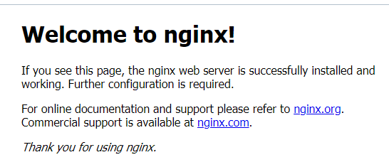

# LEMP STACK IMPLEMENTATION
This project demonstrates the implementation of Linux Nginx MySql and Nginx (LEMP) in the cloud (AWS)

##  Steps in implementing LEMP stack
+  [x] 0.  Preparing virtual linux server in AWS 
    + Create and Login to your AWS account. 
    + Select your preferred region (the closest to you) and launch a new Elastic Cloud Compute (EC2) instance of t2.micro family with Ubuntu Server 20.04 LTS (HVM).
    
      + **IMPORTANT** – save your private key (.pem file) securely and do not share it with anyone! If you lose it, you will not be able to connect to your server ever again!
      + Also ensure your Security group allows incoming traffic from port 22, which is the default prtocol for **SSH** connection.
    + Connecting to EC2 terminal
      + Change directory into the loacation where your PEM file is. Most likely will be in the Downloads folder

            cd ~/Download
      + Change premissions for the private key file (.pem), otherwise you can get an error "Bad permissions"

            sudo chmod 0400 <private-key-name>.pem

      + Connect to the instance by running
            
            ssh -i <private-key-name>.pem ubuntu@<Public-IP-address>

      + Now you have just creaated your very first Linux server in the cloud.

+ [x] 1.  Installing the **NGINX** web server 
    + For our web pages to show on the browser, that is why we are using **NGINX**. It can be intalled with the command:-

          sudo apt update
          sudo apt install nginx -y
    + To verify our newly installed **NGINX**, we run the command:-

          sudo systemctl status nginx

        + If we notice a prompt stating that it is running and turns green, then our web server was successfully installed.

        + As we know, we have TCP port 22 open by default on our EC2 machine to access it via SSH, so we need to add a rule to EC2 configuration to open inbound connection through port 80:
      

    + We can access the **NGINX** web server locally on the terminal with the command, thus displays in HTML format:-

            curl http://localhost:80
            or
            curl http://127.0.0.1:80

    + Also, you can access it on the browser using the url which will display the web server on the browser

            http://<Public-IP-Address>:80

      

+ [x] 2.  Installing Mysql 
    + Now that you have a web server up and running, you need to install a Database Management System (DBMS) to be able to store and manage data for your site in a relational database. MySQL is a popular relational database management system used within PHP environments, so we will use it in our project.
    + Again, use **apt** to acquire and install this software:

          sudo apt install mysql-server -y
    + When the installation is finished, log in to the MySQL console by typing:

          sudo mysql
      + This will connect to the MySQL server as the administrative database user root, which is inferred by the use of sudo when running this command. You should see output like this:

            Welcome to the MySQL monitor.  Commands end with ; or \g.
            Your MySQL connection id is 8
            Server version: 8.0.30-0ubuntu0.20.04.2 (Ubuntu)

            Copyright (c) 2000, 2022, Oracle and/or its affiliates.

            Oracle is a registered trademark of Oracle Corporation and/or its
            affiliates. Other names may be trademarks of their respective
            owners.

            Type 'help;' or '\h' for help. Type '\c' to clear the current input statement.

            mysql>  
      
      + It’s recommended that you run a security script that comes pre-installed with MySQL. This script will remove some insecure default settings and lock down access to your database system. Before running the script you will set a password for the root user, using mysql_native_password as default authentication method. We’re defining this user’s password as PassWord.1.

            ALTER USER 'root'@'localhost' IDENTIFIED WITH mysql_native_password BY 'PassWord.1';

        + Exit the MySQL shell with:

              mysql> exit

    + Now we can start the interactive script by running:

          sudo mysql_secure_installation
      + This will ask if you want to configure the VALIDATE PASSWORD PLUGIN. Then you can provide valid answers to the promped questions.
    
    + When you’re finished, test if you’re able to log in to the MySQL console by typing:

          sudo mysql -p

      + Notice the -p flag in this command, which will prompt you for the password used after changing the root user password.
    
    + To exit the MySQL console, type:

          mysql> exit

+ [x] 3.  Installing PHP 
    + You will be installing 2 packages of PHP by running:- 

          sudo apt install php-fpm php-mysql -y

+ [x] 4.  Configuring **NGINX** to use PHP processor
    + Create the root web directory for your_domain running the command:

          sudo mkdir /var/www/projectLEMP
    
    + Next, assign ownership of the directory with the $USER environment variable, which will reference your current system user:

          sudo chown -R $USER:$USER /var/www/projectLEMP

    + Then, open a new configuration file in Nginx’s sites-available directory using your preferred command-line editor. Here, we’ll use vi:

          sudo vi /etc/nginx/sites-available/projectLEMP

    + Paste this configuration inside the file and carefully save and exit.

          #/etc/nginx/sites-available/projectLEMP

          server {
              listen 80;
              server_name projectLEMP www.projectLEMP;
              root /var/www/projectLEMP;

              index index.html index.htm index.php;

              location / {
                  try_files $uri $uri/ =404;
              }

              location ~ \.php$ {
                  include snippets/fastcgi-php.conf;
                  fastcgi_pass unix:/var/run/php/php8.1-fpm.sock;
              }

              location ~ /\.ht {
                  deny all;
              }

          }

        + listen — Defines what port Nginx will listen on. In this case, it will listen on port 80, the default port for HTTP.
        + root — Defines the document root where the files served by this website are stored.
        + index — Defines in which order Nginx will prioritize index files for this website. It is a common practice to list index.html files with a higher precedence than index.php files to allow for quickly setting up a maintenance landing page in PHP applications. You can adjust these settings to better suit your application needs.
        + server_name — Defines which domain names and/or IP addresses this server block should respond for. Point this directive to your server’s domain name or public IP address.
        + location / — The first location block includes a try_files directive, which checks for the existence of files or directories matching a URI request. If Nginx cannot find the appropriate resource, it will return a 404 error.
        + location ~ \.php$ — This location block handles the actual PHP processing by pointing Nginx to the fastcgi-php.conf configuration file and the php7.4-fpm.sock file, which declares what socket is associated with php-fpm.
        + location ~ /\.ht — The last location block deals with .htaccess files, which Nginx does not process. By adding the deny all directive, if any .htaccess files happen to find their way into the document root ,they will not be served to visitors.

    + Activate your configuration by linking to the config file from Nginx’s sites-enabled directory:

          sudo ln -s /etc/nginx/sites-available/projectLEMP /etc/nginx/sites-enabled/

    + Test the configuration for syntax errors by typing:

          sudo nginx -t

        + You shall see following message:

              nginx: the configuration file /etc/nginx/nginx.conf syntax is ok
              nginx: configuration file /etc/nginx/nginx.conf test is successful
    + we also need to disable the default Nginx host by typing:-  

          sudo unlink /etc/nginx/sites-enabled/default
    + After which you reload your Nginx to apply the changes by running

          sudo systemctl reload nginx
    + Currently the web page is empty, we can insert some text for clarification by running:- 

          sudo echo 'Hello LEMP from hostname' $(curl -s http://169.254.169.254/latest/meta-data/public-hostname) 'with public IP' $(curl -s http://169.254.169.254/latest/meta-data/public-ipv4) > /var/www/projectLEMP/index.html

    + Now go to your browser and try to open your website URL using IP address:

          http://<Public-IP-Address>:80
    
    + You can then see your public Ip displayed with some random text in your browser

+ [x] 5.  Testing **PHP** with **NGINX** 
    + At this point, your LAMP stack is completely installed and fully operational. 
    + **L**inux (Ubuntu) 
    + **N**ginx HTTP Server 
    + **M**ySQL 
    + **P**HP 
    
    + You can test it to validate that Nginx can correctly hand .php files off to your PHP processor.
      + Open a new file called info.php within your document root in your text editor:

            sudo vi /var/www/projectLEMP/info.php
      
      + Type or paste the following command

            <?php
            phpinfo();

    + You can now access the page in your web browser by visiting:-

            http://`server_domain_or_IP`/info.php
    
    + You will see a web page containing detailed information about your server: 

      
    
    + You can remove the file created because it contains sensitive information about your environment for security reasons.

          sudo rm /var/www/your_domain/info.php
  
+ [x] 6.  Retrieving data from mysql database with **PHP** 
    + First, connect to the MySQL console using the root account:

          sudo mysql -p
    + To create a new database, run the following command from your MySQL console:

          mysql> CREATE DATABASE `example_database`;
    
    + Now you can create a new user and grant him full privileges on the database you have just created.

          CREATE USER 'example_user'@'%' IDENTIFIED WITH mysql_native_password BY 'password';
        + You can as well change the password and the example_user to suite your need
    + we need to give this user permission over the example_database database:

          mysql> GRANT ALL ON example_database.* TO 'example_user'@'%';
    
    + Now exit the MySQL shell with:

          mysql> exit
    
    + You can test if the new user has the proper permissions by logging in to the MySQL console again, this time using the custom user credentials created earlier:

          mysql -u example_user -p
    
    + After accessing to the mysql console, you cancheck the databases;

          mysql> SHOW DATABASES;
        + Giving you the output of:

              Output
              +--------------------+
              | Database           |
              +--------------------+
              | example_database   |
              | information_schema |
              +--------------------+
              2 rows in set (0.000 sec)
    
    + Next, we can create a test table named todo_list. From the MySQL console, run the following statement:

          CREATE TABLE example_database.todo_list (
          mysql>     item_id INT AUTO_INCREMENT,
          mysql>     content VARCHAR(255),
          mysql>     PRIMARY KEY(item_id)
          mysql> );
        + Ignore the mysql> above, just indicating mysql console
    + Insert a few rows of content in the test table. You might want to repeat the next command a few times, using different VALUES:

          mysql> INSERT INTO example_database.todo_list (content) VALUES ("My first important item");
    + To confirm that the data was successfully saved to your table, run:

          mysql>  SELECT * FROM example_database.todo_list;
    
    + You’ll see the following output:

          Output
          +---------+--------------------------+
          | item_id | content                  |
          +---------+--------------------------+
          |       1 | My first important item  |
          |       2 | My second important item |
          |       3 | My third important item  |
          |       4 | and this one more thing  |
          +---------+--------------------------+
          4 rows in set (0.000 sec)

    + After confirming that you have valid data in your test table, you can exit the MySQL console:

          mysql> exit
    
    + Now you can create a PHP script that will connect to MySQL and query for your content: -  

          sudo vi /var/www/projectLEMP/todo_list.php
    
    + Copy and paste the below code and then save and close

          <?php
          $user = "example_user";
          $password = "password";
          $database = "example_database";
          $table = "todo_list";

          try {
            $db = new PDO("mysql:host=localhost;dbname=$database", $user, $password);
            echo "<h2>TODO</h2><ol>";
            foreach($db->query("SELECT content FROM $table") as $row) {
              echo "<li>" . $row['content'] . "</li>";
            }
            echo "</ol>";
          } catch (PDOException $e) {
              print "Error!: " . $e->getMessage() . " ";
              die();
          }

    + You can now access this page in your web browser by visiting the domain name or public IP address configured for your website, followed by /todo_list.php:

          http://<Public_domain_or_IP>/todo_list.php

    + You should see a page like this, showing the content you’ve inserted in your test table:

        

    + That means automatically your PHP environment is ready to connect and interact with your MySQL server.
